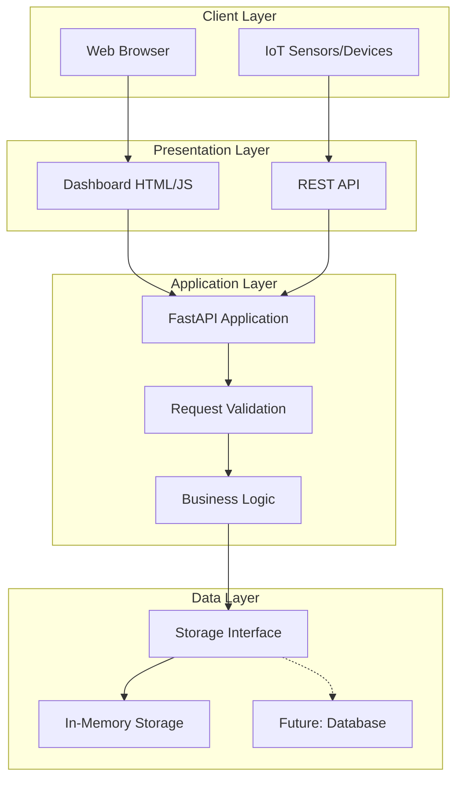
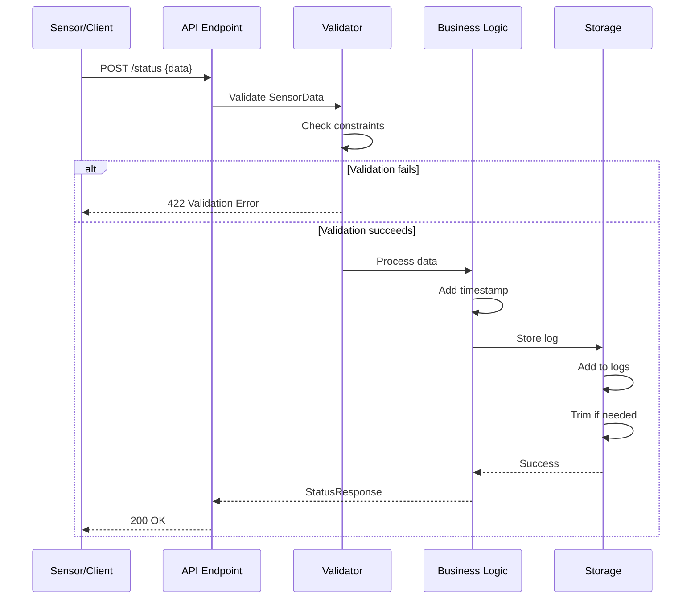
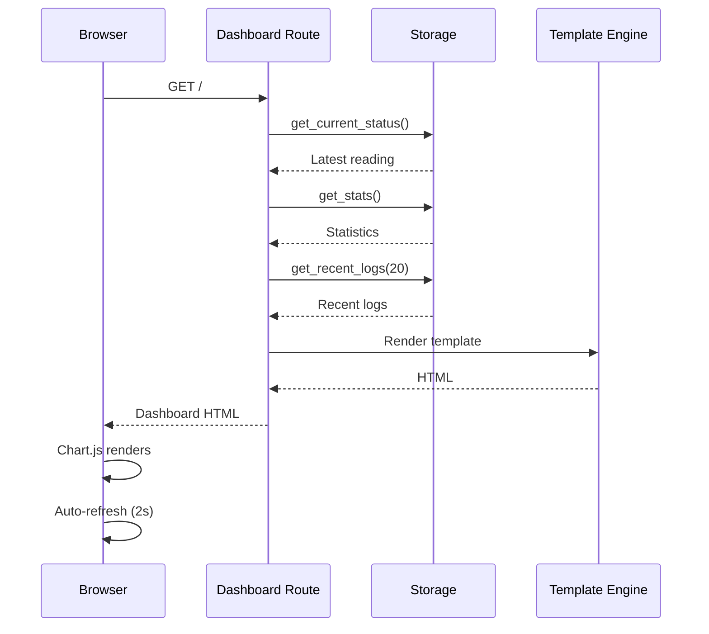

# Fire Detection System - Architecture

## Overview

The Fire Detection System is a real-time monitoring application designed to track temperature and gas levels for fire detection. It follows a modular, layered architecture with clear separation of concerns.

## System Architecture



## Component Details

### 1. Main Application (`main.py`)

**Purpose**: Entry point and API route definitions

**Responsibilities**:
- FastAPI application initialization
- Route handlers for all endpoints
- Middleware configuration (CORS)
- Dependency injection setup
- Error handling

**Key Features**:
- Health check endpoint for monitoring
- Status update endpoint for sensor data
- Dashboard rendering
- Statistics API
- Admin endpoints (clear logs)

### 2. Configuration (`config.py`)

**Purpose**: Centralized configuration management

**Responsibilities**:
- Environment variable loading
- Application settings
- CORS configuration
- Logging configuration
- Storage limits

**Design Pattern**: Singleton pattern with Pydantic Settings

### 3. Data Models (`models.py`)

**Purpose**: Data validation and serialization

**Responsibilities**:
- Request/response schemas
- Field validation
- Type safety
- Documentation examples

**Models**:
- `SensorData`: Core sensor reading model
- `StatusResponse`: API response wrapper
- `DashboardStats`: Statistics aggregation
- `HealthResponse`: Health check data

**Validation Rules**:
- Temperature: -50°C to 150°C (rounded to 2 decimals)
- Gas: 0 to 10000 ppm (non-negative integer)
- Status: Literal type ("danger" | "normal")

### 4. Storage Layer (`storage.py`)

**Purpose**: Data persistence abstraction

**Responsibilities**:
- Abstract storage interface
- In-memory implementation
- CRUD operations
- Statistics calculation
- Log rotation

**Design Pattern**: Repository pattern with interface abstraction

**Current Implementation**: `InMemoryStorage`
- Fast access with Python list
- Automatic log rotation (configurable max)
- Thread-safe operations

**Future Extensions**:
- SQLite database storage
- PostgreSQL storage
- Redis caching layer

### 5. Utilities (`utils.py`)

**Purpose**: Shared helper functions

**Responsibilities**:
- Logging configuration
- Timestamp formatting
- Data formatting helpers
- Business logic utilities

## Data Flow

### Sensor Data Update Flow



### Dashboard Rendering Flow



## Technology Stack

### Backend
- **FastAPI**: Modern async web framework
- **Pydantic**: Data validation and settings
- **Uvicorn**: ASGI server
- **Python 3.11+**: Core language

### Frontend
- **Jinja2**: Server-side templating
- **Chart.js**: Data visualization
- **Vanilla CSS**: Styling (no framework)
- **Vanilla JavaScript**: Client-side logic

### Testing
- **Pytest**: Test framework
- **HTTPX**: Async HTTP client for tests
- **pytest-cov**: Coverage reporting

### DevOps
- **Docker**: Containerization
- **Docker Compose**: Local orchestration
- **Environment Variables**: Configuration

## Design Decisions

### 1. In-Memory Storage
**Decision**: Use in-memory list for initial implementation

**Rationale**:
- Simple and fast for MVP
- No external dependencies
- Easy to extend to database later
- Sufficient for demo/testing

**Trade-offs**:
- Data lost on restart
- Limited by RAM
- Not suitable for production at scale

### 2. Pydantic Validation
**Decision**: Use Pydantic for all data validation

**Rationale**:
- Type safety
- Automatic API documentation
- Clear error messages
- Runtime validation

### 3. Dependency Injection
**Decision**: Use FastAPI's dependency injection for storage

**Rationale**:
- Testability (easy to mock)
- Flexibility (swap implementations)
- Clean code (no global state)

### 4. Auto-refresh Dashboard
**Decision**: Client-side page reload every 2 seconds

**Rationale**:
- Simple implementation
- No WebSocket complexity
- Acceptable for low-frequency updates

**Alternative**: WebSocket for real-time push (future enhancement)

### 5. Modular Architecture
**Decision**: Separate files for config, models, storage, utils

**Rationale**:
- Maintainability
- Testability
- Clear responsibilities
- Easy to navigate

## Security Considerations

1. **Input Validation**: All inputs validated with Pydantic
2. **CORS Configuration**: Configurable allowed origins
3. **No Authentication**: Currently open (add auth for production)
4. **Environment Variables**: Sensitive config externalized
5. **Logging**: Audit trail for all operations

## Performance Characteristics

- **Latency**: <10ms for status updates (in-memory)
- **Throughput**: Thousands of requests/second (async)
- **Memory**: ~1KB per log entry
- **Scalability**: Horizontal scaling with load balancer

## Future Enhancements

1. **Database Integration**
   - PostgreSQL for persistent storage
   - Time-series database (InfluxDB) for analytics

2. **Real-time Updates**
   - WebSocket support
   - Server-Sent Events (SSE)

3. **Authentication & Authorization**
   - JWT tokens
   - Role-based access control

4. **Advanced Analytics**
   - Trend analysis
   - Anomaly detection
   - Predictive alerts

5. **Multi-sensor Support**
   - Sensor registration
   - Location tracking
   - Sensor health monitoring

6. **Alerting System**
   - Email notifications
   - SMS alerts
   - Webhook integrations

## Deployment Architecture

### Development
```
Developer → Local Server (uvicorn --reload)
```

### Production (Cloud)
```
Internet → Load Balancer → App Instances (Docker) → Database
                         ↓
                    Monitoring/Logging
```

## Monitoring & Observability

- **Health Checks**: `/health` endpoint
- **Structured Logging**: JSON logs for parsing
- **Metrics**: Uptime, request counts (future: Prometheus)
- **Tracing**: Request IDs (future: OpenTelemetry)

---

This architecture provides a solid foundation for a production-ready fire detection system while maintaining simplicity and extensibility.
